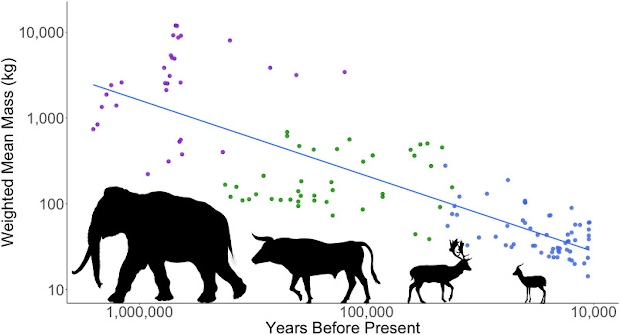
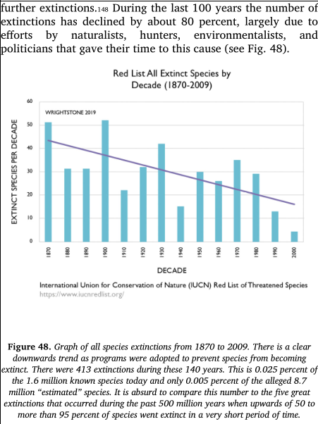

<!DOCTYPE html>
<meta http-equiv="content-type" content="text/html; charset=utf-8">
<link rel="stylesheet" href="../css/style.css" type="text/css">
<!-- PLAIN TEXT -->
DATE: 2022-01-09
TITLE/H1: Humanos Extinguem Animais Há 1,5 Milhões de Anos
DESCRIPTION: Novo estudo interessante sobre tamanho da caça e evolução humana.
KEYWORDS: evolução, meio ambiente, nota
LANGUAGE: 

<!-- DATE MUST BE IN THE FORMAT YYY-MM-DD -->
<!-- H1 WILL BE ADDED TO POST/ARTICLE HEADER -->
<!-- KEYWORD DELIMITER IS COMMA -->

<!-- HYPERTEXT -->

Um estudo interessante que saiu há pouco tempo determina
que o ser humano foi responsável pela extirpação e extinção
de algumas espécies em alguns lugares no mundo.

> Pela primeira vez, argumentamos que a força motriz por trás do aprimoramento constante da tecnologia humana é o declínio contínuo do *tamanho da caça*. Em última análise, pode muito bem ser que, há 10.000 anos, no sul do Levante, os animais tenham se tornado pequenos ou raros demais para fornecer comida suficiente aos humanos, e isso pode estar relacionado ao advento da agricultura.

<figure>
	<figcaption>Figura 1. Ao longo do Pleistoceno, novas linhagens humanas caçaram presas cada vez menores do que as anteriores.</figcaption>
	
</figure>

<ul lang="en">
  <li><a href="https://www.sciencedirect.com/science/article/abs/pii/S0277379121005230">Levantine overkill: 1.5 million years of hunting down the body size distribution</a></li>

  <li><a href="https://www.timesofisrael.com/early-humans-repeatedly-killed-out-the-biggest-beasts-around-israeli-study-finds/">Early humans repeatedly killed off the biggest beasts around, Israeli study finds</a></li>

  <li><a href="https://phys.org/news/2021-12-early-humans-largest-animals-extinction.html">Early humans hunted the largest available animals to extinction for 1.5 million years</a></li>

  <li><a href="https://www.sciencedaily.com/releases/2021/12/211221102708.htm">From giant elephants to nimble gazelles: Early humans hunted the largest available animals to extinction for 1.5 million years, study finds</a></li>

  <li><a href="https://www.jpost.com/archaeology/article-689385">Research by Tel Aviv University scholars analyzed data and remains from dozens of sites in the southern Levant.</a></li>

</ul>

Apesar de resultados interessantes, fico com o pé meio atrás
sobre as conclusão do estudo que diz que mudanças climáticas tiveram
pouca, se alguma, influência na extinção de espécies no último
milhão e meio de anos no *Levant*. Acho muito suspeito descartar
mudanças de clima e geológicas tão facilmente como os autores
fazem no artigo, assim como outros autores descartam facilmente
demais certos argumentos e circunstâncias..

Ainda não tive tempo de ler o artigo inteiro, mas tenho certeza que
várias partes do artigo podem ser usadas para substanciar
nossas pesquisas sobre biodiversidade..

De certa geral, esse artigo nos redime de pecado
com relação a extinção de certas espécies. A *condição* do surgimento
do ser humano foi a caça e nunca um cérebro como o nosso poderia
ser energeticamente suprido com vegetais somente.

Ao mesmo tempo, o artigo infere que os ecossistemas estão se adaptando
à influência do ser humano há pelo menos 1,5 milhões de anos. Seria
idiotice achar que o *planeta Terra tenha sofrido* com a existência do ser
humano ao longo desse período. Não no esqueçamos que populações
de hominídeos não eram tão grandes assim no passado..

Um cientista extraterrestre ao observar a história na Terra não deveria
achar o ser humano a *escória do planeta Terra*. Na verdade, é uma
espécie belíssima que se desenvolveu graças a uma estrutura de suporte
estabelecida pela vida inferior na Terra e quais espécies interagem entre si.
O ser humano é somente um parafuso nessa grande engrenagem de Gaia.

Na verdade, tento
analisar a existência do ser humano com a perspectiva de um cientista com um
corpo diferente e de outro planeta, por exemplo, um cientista alienígena
parecido com um polvo para me eximir de influências humanas.

---

Abaixo, uma resposta a um tópico no twttr sobre esse estudo científico.

> Antonio Dominguez
> 
> @AntonioSLW 16 Dec 2021
> 
> Replying to @MU_Peter
> 
> Parte del ciclo de la naturaleza. Nunca fueron tantos humanos como para extinguir especies enteras. Solo hay que ver cementerios naturales donde se encuentran varias especies en grandes cantidades.
> Seguir pensando que tenemos tanto poder es ridículo. la naturaleza es la grande.
>
> <https://twitter.com/MU_Peter/status/1471487834607468551>

---

Há também um resultado interessante de pesquisa publicada pelo 
[Wrightstone (2019)](https://wattsupwiththat.com/2019/05/27/gregory-wrightstone-exposing-the-mass-extinction-lie/),
também comentada no livro do Patrick Moore de 2021.

<blockquote>

Durante os últimos 100 anos, o número de extinções diminuiu cerca de 80%, em grande parte devido aos esforços de naturalistas, caçadores, ambientalistas e políticos que dedicaram seu tempo a essa causa (ver Fig. 48).

<a href="https://www.amazon.com.br/Fake-Invisible-Catastrophes-Threats-English-ebook/dp/B08T6FFY6S" lang="en" hreflang="en">Fake Invisible Catastrophes and Threats of Doom (2021)</a>, Patrick Moore

</blockquote>

<figure>
	<figcaption>Figura 2. 
Gráfico de todas as extinções de espécies de 1870 a 2009. Há uma clara tendência de queda à medida que foram adotados programas para evitar a extinção de espécies. Houve 413 extinções durante esses 140 anos. Isso representa 0,025% das 1,6 milhão de espécies conhecidas hoje e apenas 0,005% das supostas 8,7 milhões de espécies “estimadas”. É absurdo comparar esse número com as cinco grandes extinções que ocorreram nos últimos 500 milhões de anos, quando mais de 50% até 95% das espécies foram extintas em um período muito curto de tempo.</figcaption>
	
</figure>

