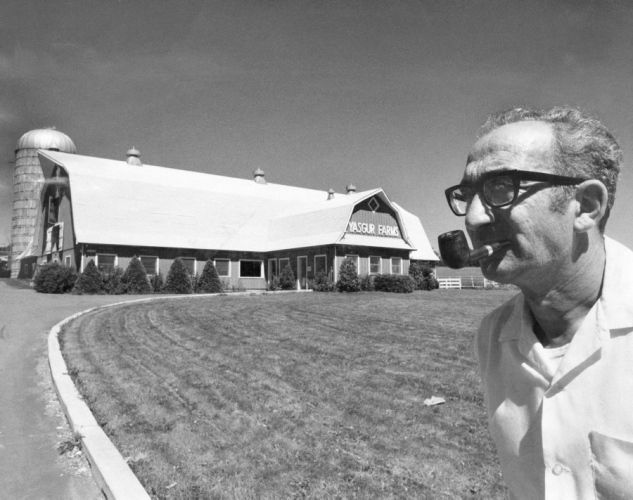

<!DOCTYPE html>
<meta http-equiv="content-type" content="text/html; charset=utf-8">
<link rel="stylesheet" href="../css/style.css" type="text/css">
<!-- PLAIN TEXT -->
DATE: 2022-01-14
TITLE/H1: Michael Lang e Woodstock
DESCRIPTION: Notas e reflexões com a passagem do Michael Lang,
idealizador e organizador do Festival Woodstock de Música e Arte.
KEYWORDS: reflexões, rock'n'roll, memórias, esperança, paz e amor, música
LANGUAGE: 

<!-- DATE MUST BE IN THE FORMAT YYY-MM-DD -->
<!-- H1 WILL BE ADDED TO POST/ARTICLE HEADER -->
<!-- KEYWORD DELIMITER IS COMMA -->

<!-- HYPERTEXT -->

Há pouco tempo atrás, talvez alguns meses, descobri um pouco
mais sobre Woodstock (principalmente através das *sugestões* do YouTube)
e o conheci o idealizador e um dos organizadores do Woodstock,
**Michael Lang**, e um pouco de sua história.

Uma pena que não fui atrás da história do Festival mais cedo.
Sempre, em primeiro lugar, estive mais interessado na música, é claro.
Mas agora que amadureci, a história do Woodstock se torna cada vez mais
fascinante de aprender.

Com [Michael pendurando as botinas](https://www.nytimes.com/2022/01/11/arts/music/michael-lang-dead.html)
semana passada, comecei a refletir mais
sobre o festival de Woodstock. Sou bastante fã do Rock'n'Roll de Woodstock
há mais de uma década e sempre ouço muitas apresentações quando estou
em momentos de lazer e relaxamento.
É um dos poucos tipos de música que escuto
por que me faz um bem danado e não me coloca em
bad trips. Assim como
a Janis Joplin falou em sua apresentação,
aquilo <q>é só música, sabe, não é para te colocar para baixo</q>,
música boa para curtir..

Foi com bastante tristeza saber da morte de Michael, mas
estou me sentindo renovado com as energias do Woodstock.
Tenho visto alguns vídeos de músicas, entrevistas e sites
que vou referenciar abaixo. Tem uma história muito fascinante
por detrás do Woodstock que vou descobrir aos poucos.

Mesmo aqueles que tinham 15 anos quando participaram do Woodstock
original estão bem de idade.. O festival parece que [continua
aos trancos e barrancos](https://www.yasgurroadreunion.com/)
graças a ajuda da família do Roy Howards, que detém a propriedade
da casa do agricultor Max Yasgur e uma pequena parcela de terra
ao entorno. O sítio original onde ocorreu o Woodstock não
foi exatamente lá, mas por vários motivos o campo original onde estava
o palco do festival foi vendido para outras pessoas e há algumas décadas
se transformou em um local de eventos muito grande, com museu e palco
permanente, mas muito diferente dos ideias originais.

<figure>
	
	<figcaption>Figura 1. Max Yasgur em frente a casa sede de sua
	fazenda de gado leiteiro.</figcaption>
</figure>

Há uma batalha
sendo enfrentada na cidade de Bethel pois muitos moradores
e governantes tentam barrar de toda a forma as reuniões
posteriores que os peregrinos de rock tentam formar,
por volta da data do evento em 15, 16 e 17 de agosto, todo ano.

É um sonho um dia poder ir em alguma dessas reuniões na propriedade
do Roy Howards e até mesmo no complexo de performance de arte
(<a href="https://virtualglobetrotting.com/map/site-of-woodstock-festival/view/google/">Bethel Woods Center for the Arts</a>)
que o bilionário Alan Gerry construiu na colina original.
O nome "Woodstock" está  protegido do uso por Mr. Gerry e outros
por direitos autorais, os quais Michael Lang tem direito autoral de uso.

O <a title="The Road to Woodstock, 2009" hreflang="en" href="https://www.amazon.com/Road-Woodstock-Michael-Lang/dp/0061576581">Michael tem um livro</a>
de suas memórias que espero [pegar para ler](the-road-to-woodstock-michael-lang.mobi) 
uma hora dessas..

Estou bem inspirado, como já falei. Pretendo ter um final de semana
bem gostoso e planejar algumas coisas para semana que vem *e para o futuro*!
Hoje, sexta-feira, desejo a todos que o espírito
de liberdade, paz e amor com a natureza esteja com todos nós!

### Lista de Link

<dl>
  <dt><a href="https://www.youtube.com/watch?v=brU33X7c1Do">YASGURS Road Reunion - 2019 50th Woodstock Reunion - Michael Lang Interview & Drum Circle - YouTube</a></dt>
   <dd>This footage has been hidden to me for a while but it was recorded by Joe Davis and the Front Row Dave productions at the Yasgurs Road Reunion 50th anniversary...</dd>

  <dt><a href="https://douging.smugmug.com/Music/Woodstock-1969-Concert-Site/">Woodstock 1969 Concert Site</a></dt>
   <dd>"For the most part, it was rural country and our site at Bethel was situated on a pristine piece of alfalfa field that backed onto a beautiful lake. An incredibly bucolic, peaceful place." - Michael Lang, co-creator of the Woodstock Festival.</dd>

  <dt><a href="https://www.nytimes.com/2007/08/12/nyregion/12woodstock.html">A Beloved Woodstock Nation Site Goes on Sale, for $8 Million</a></dt>
   <dd>The owners of “Yasgur’s Farm,” a house and piece of land made famous by the 1969 Woodstock music festival, are selling the property and moving to Arizona.</dd>

  <dt><a href="https://time.com/5645555/woodstock-max-yasgur/">Max Yasgur Rented His Farm for Woodstock. His Neighbors Sued</a></dt>
   <dd>Max Yasgur agreed to let Woodstock organizers rent his land to hold their festival. His neighbors never forgave him, but he didn't regret it</dd>

  <dt><a href="https://www.youtube.com/watch?v=FXLRDQmZcSE">Woodstock Story With Michael Lang and Henry Diltz</a></dt>
   <dd>Michael Lang, Woodstock Festival co-creator, and Henry Diltz, rock n roll photographer, share stories about the 1969 Woodstock concert while showing Henry's ...</dd>

  <dt><a href="https://www.youtube.com/watch?v=swyfP92Gzdg">Woodstock 40 years on: Michael Lang on the world's most famous music festival</a></dt>
   <dd>In 1969, Michael Lang organised what became the most famous music festival in the world. Four decades on, he looks back in time and history.</dd>

  <dt><a href="https://www.nytimes.com/2019/08/01/arts/music/woodstock-50.html">The Disastrous Woodstock 50: What Went Wrong?</a></dt>
   <dd>An announcement with no tickets. Four permit requests rejected by one small town. How the event celebrating the anniversary of a landmark rock festival crumbled.</dd>

  <dt><a href="https://www.poughkeepsiejournal.com/story/news/local/2019/08/16/woodstock-2019-max-yasgur-road-reunion-farm-festival/2028464001/">Woodstock 2019: 'Reunion' at Max Yasgur's farm carries on 1969 legacy</a></dt>
   <dd>Deep in the woods on what was once Max Yasgur's Sullivan County dairy farm, down winding, muddy trails that have a tendency to suck shoes off of the feet that pass through, there's a hidden festival.</dd>

  <dt><a href="https://www.youtube.com/watch?app=desktop&v=GX6e0tp9L_o">Woodstock Co-Creator Announces 50th Anniversary Festival</a></dt>
   <dd>Mike still carries himself as a young hippie, Still has a youthful voice despite his older age.</dd>

  <dt><a href="https://www.youtube.com/watch?v=58SrSOJuIlI">Sly & The Family Stone Dance To The Music Live Woodstock</a></dt>
   <dd>Sly & The Family Stone Dance To The Music Live WoodstockLe Festival de Woodstock (Woodstock Music and Art Fair, ou Woodstock) est un festival de musique et ...</dd>

  <dt><a href="https://www.youtube.com/watch?v=tQ0PSpHFV_s">Sly The Family Stone Higher And Higher live</a></dt>
   <dd>harto funk para despejar la cabeza!</dd>

  <dt><a href="https://www.youtube.com/watch?v=XnsB4Ck__OE">John Sebastian - Younger Generation @ Woodstock 1969</a></dt>
   <dd>John Sebastian with "Younger Generation"from a film about Woodstock 1969 :-)</dd>

  <dt><a href="https://www.youtube.com/watch?v=rBXL7FaPod4">John Sebastian - Darling Be Home Soon @ Woodstock 1969</a></dt>
   <dd>As always, your comments and ratings are greatly appreciated.Copyright Disclaimer Under Section 107 of the Copyright Act 1976, allowance is made for "fair us...</dd>

  <dt><a href="https://www.youtube.com/watch?v=4602ld2Ym9E">Joe Cocker - A Little Help From My Friends</a></dt>
   <dd>Max Yasgur participation short discourse. There was two shows at the 1969 Woodstock Music Festival.One was on stage.One was the people off stageThis is my montage of the people and face's of Woodstoc...</dd>

  <dt><a href="https://www.riverreporter.com/stories/roy-howard-dies-owner-of-yasgurs-farm,10243?">Roy Howard dies; Owner of Yasgur’s Farm</a></dt>
   <dd>PHOENIX, AZ — Roy Howard, who, with his wife Jeryl Abramson, waged a long-running legal battle with officials from the Town of Bethel, has died, according to numerous sources. Howard’s Facebook &hellip;</dd>

  <dt><a href="https://time.com/5614796/woodstock-archaeology/">What Archeologists Found at the Farm Where Woodstock Was Held</a></dt>
   <dd>A team of scientists explored the farm in Bethel, New York, where the 1969 Woodstock concert was held.</dd>

  <dt><a href="https://www.haaretz.com/jewish/1973-woodstock-s-unlikely-host-dies-1.5401698">1973: The farmer who defied his neighbors and hosted Woodstock dies</a></dt>
   <dd>Max Yasgur was still thinking over the proposal when his neighbors called for a boycott of his business. That did it, and thus the dairy farmer became a counterculture hero.</dd>

  <dt><a href="https://www.woodstock.com/about/">Woodstock Oficial Website</a></dt>
   <dd>In August 1969, the Woodstock Music & Art Fair took place on a dairy farm in Bethel, NY. Over half a million people came to a 600-acre farm to hear 32 acts (leading and emerging performers of the time) play over the course of four days (August 15-18).</dd>

  <dt><a href="https://www.youtube.com/watch?v=kvWgPIhuCpQ">Woodstock interview 1969</a></dt>
   <dd>An interview from a flower child who experienced the woodstock festival in 1969</dd>

  <dt><a href="https://en.wikipedia.org/wiki/San_Francisco_(Be_Sure_to_Wear_Flowers_in_Your_Hair)">San Francisco (Be Sure to Wear Flowers in Your Hair)</a></dt>
   <dd>John Phillips played guitar on the recording and session musician Gary L. Coleman played orchestra bells and chimes. Bass guitar was supplied by session musician.</dd>

  <dt><a href="https://en.wikipedia.org/wiki/Hog_Farm">Hog Farm</a></dt>
   <dd>The Hog Farm is an organization considered America's longest running hippie commune.</dd>

</dl>

